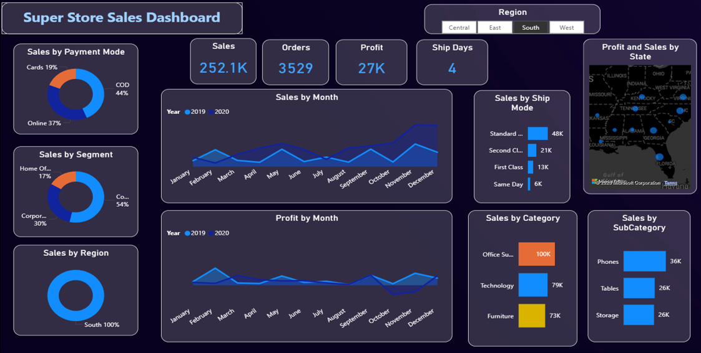

📊 Task 4: Dashboard Design
📌 Overview

This project presents an interactive Sales Performance Dashboard created using Power BI.
The dashboard helps analyze sales data and provides meaningful insights for business decision-making.

🎯 Objective
To design an interactive dashboard for business stakeholders
To analyze sales and profit performance
To present insights using data visualization techniques

🛠️ Tools Used
Power BI
📊 Dashboard Features
KPI Cards (Total Sales, Total Profit)
Time-Series Analysis (Monthly Sales & Profit Trend)
Sales by Category and Sub-Category
Sales by Ship Mode
Map Visualization (State-wise Sales)
Slicers for interactivity (Region, Category, Year)

🔍 Key Insights
Sales show an overall increasing trend over time
Technology category contributes highest sales
Standard Class is the most used shipping mode
Certain regions and states generate higher revenue

📁 Files Included
Task-4-Dashboard.pbix

📸 Dashboard Preview

## 📊 Power BI Dashboard File
[Click here to view/download dashboard](https://drive.google.com/file/d/17yxIL2qJmWbvxQZDZ13sMXtLHxAGFxKs/view?usp=sharing)

✅ Conclusion

This dashboard provides clear and meaningful insights into business performance.
It supports data-driven decision-making and enhances user interaction through slicers and visual elements.

